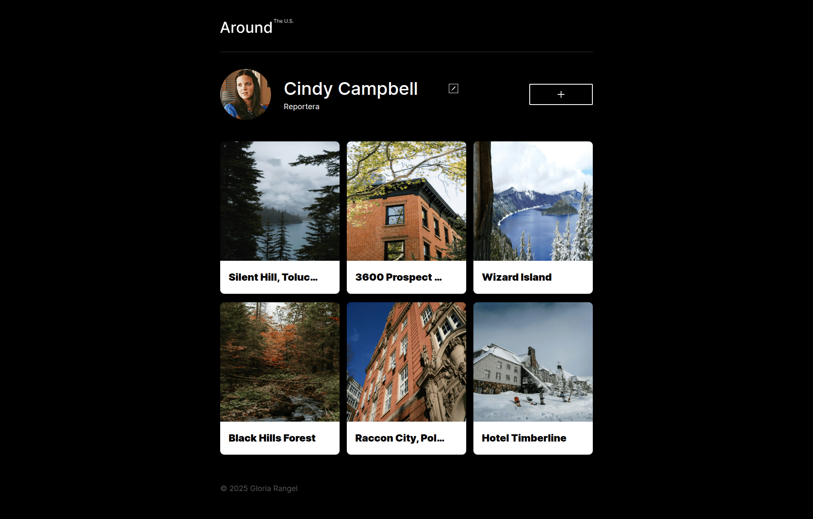

# Alrededor de los EE. UU. (React) 🇺🇸📸

## 📝 Descripción del proyecto

**"Alrededor de los EE. UU."** es una galería web interactiva creada como parte del proyecto número 14 del bootcamp de desarrollo web de [TripleTen](https://tripleten.com/).Se realizó la migración para ser adaptado al framework React.js y marcado JSX, actualmente cuenta con el renderizado básico de header, main, footers, tarjetas y ventanas emergentes. Actualmente no cuenta con ninguna funcionalidad mas que apertura y cierre de modales, aparte del renderizado de un mocks de tarjetas. 

### 🖱️ Funcionalidades implementadas:
- Ventanas modales con funcionalidad de abrir/cerrar.
- Visualización de una galería de lugares destacados en Estados Unidos.
- Diseño responsivo para distintas resoluciones.
- Vista ampliada de la imagen mediante un popup modal al hacer clic sobre la foto.

### 💻 Tecnologías utilizadas:
- React.js
- JSX
- HTML5
- CSS3
- JavaScript (DOM, eventos, manipulación de nodos, módulos)
- Metodología BEM
- Git & GitHub Pages

### 🚀 Despliegue
Puedes ver el proyecto en línea accediendo a través del siguiente enlace:

🔗 [https://around-us-react-by-gr.netlify.app/](https://around-us-react-by-gr.netlify.app/)

### 📷 Captura de pantalla:

## 💡 Planes de mejora

A futuro, me gustaría implementar las siguientes mejoras:

- Añadir animaciones suaves al abrir/cerrar popups.
- Edición del perfil directamente desde un formulario emergente.
- Botón de "like"que cambia de estado activo/inactivo.  
- Botón para eliminar tarjeta, que permite removerla de la galería. 
- Validación de formularios.
- Cierre de popup haciendo clic en superposición y al pulsar tecla *Esc*.
- Edición de la información del perfil.
- Actualización de la imagen de perfil.
- Loaders en los botones de los pop-ups.
- Confirmación para eliminar tarjetas.

---

Este proyecto marcó el inicio de mi práctica con la librería de React en su versión para web, permitiéndome combinar habilidades visuales y funcionales para crear interfaces más dinámicas y centradas en el usuario.
