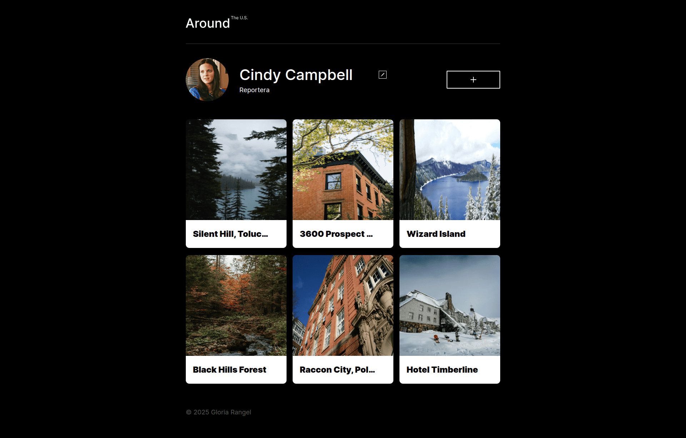

# Alrededor de los EE. UU. (React) 🇺🇸📸

## 📝 Descripción del proyecto

**"Alrededor de los EE. UU."** es una galería web interactiva creada como parte del proyecto número 18 del bootcamp de desarrollo web de [TripleTen](https://tripleten.com/).Se realizó la migración para ser adaptado al framework React.js y marcado JSX. Ofrece una experiencia de usuario completa que incluye validación de formularios, visualización de errores en la interfaz, edición de perfil, creación de nuevas tarjetas con imagen, botones de “me gusta” y eliminación.
La información del perfil, incluida la imagen, puede actualizarse, y se ha implementado una confirmación para la eliminación de tarjetas.

Actualmente, el proyecto cuenta con conexión a un servidor para la persistencia de datos.

### 🖱️ Funcionalidades implementadas:
- Ventanas modales con funcionalidad de abrir/cerrar.
- Visualización de una galería de lugares destacados en Estados Unidos.
- Diseño responsivo para distintas resoluciones.
- Vista ampliada de la imagen mediante un popup modal al hacer clic sobre la foto.
- Edición del perfil directamente desde un formulario emergente.
- Botón de "like" que cambia de estado activo/inactivo.
- Botón para eliminar tarjeta, que permite removerla de la galería.
- Actualización de la imagen de perfil.
- Registro de nuevos usuarios con modal de confirmación (éxito/error).
- Inicio de sesión con autenticación mediante JWT.
- Cierre de sesión desde el encabezado.
- Rutas protegidas que impiden el acceso al contenido principal sin autenticación.
- Persistencia de sesión mediante almacenamiento del token en localStorage, evitando que el usuario tenga que iniciar sesión en cada visita.
- Header dinámico que muestra opciones distintas según el estado de autenticación del usuario.
- Sanitización de inputs en todos los formularios para mayor seguridad.

### 💻 Tecnologías utilizadas:
- React.js
- React context
- JWT
- API
- JSX
- HTML5
- CSS3
- JavaScript (DOM, eventos, manipulación de nodos, módulos)
- Metodología BEM
- Git & GitHub Pages

### 🚀 Despliegue
Puedes ver el proyecto en línea accediendo a través del siguiente enlace:

🔗 [https://web-project-around-react-by-gr.netlify.app/](https://web-project-around-react-by-gr.netlify.app/)

### 📷 Captura de pantalla:

## 💡 Planes de mejora

A futuro, me gustaría implementar las siguientes mejoras:

- Añadir animaciones suaves al abrir/cerrar popups.
- Validación de formularios.
- Cierre de popup haciendo clic en superposición y al pulsar tecla *Esc*.
- Loaders en los botones de los pop-ups.
- Confirmación para eliminar tarjetas.

---

Este proyecto marcó la continuación de mi práctica con la librería de React en su versión para web, permitiéndome combinar habilidades visuales y funcionales para crear interfaces más dinámicas y centradas en el usuario.
